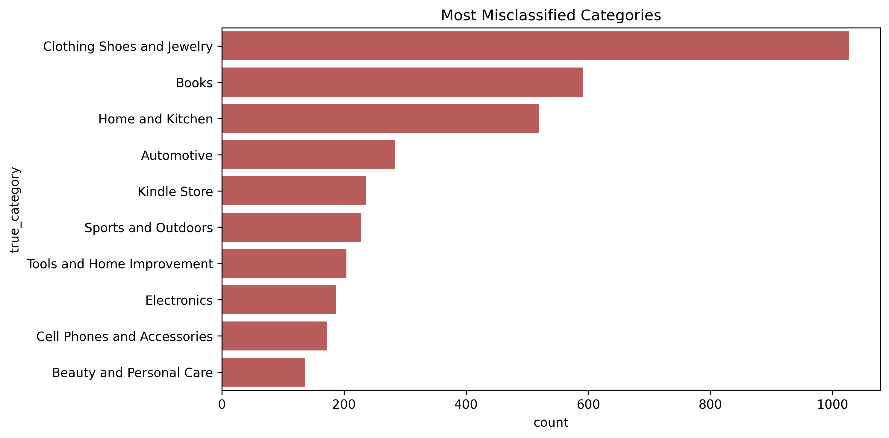
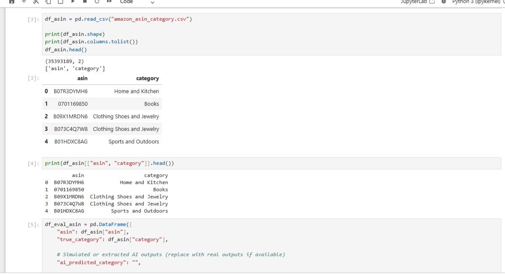

# AI-Evaluation-of-Product-Category-Assignment-and-Factual-Grounding-Using-Amazon-ASIN-Taxonomy
This project evaluates how accurately AI assigns product categories by comparing predictions against a large-scale ASIN taxonomy dataset. It highlights factual grounding issues, misclassification patterns, and business impact.

# 🧠 AI Evaluation of Product Category Assignment and Factual Grounding (Amazon ASIN Dataset)

## 📌 Overview
This project evaluates AI-generated product category assignments using the **Amazon ASIN taxonomy dataset**.

It focuses on:
- taxonomy correctness  
- factual grounding  
- category validation  

---

## 🎯 Objectives
- Evaluate whether AI outputs assign correct product categories  
- Identify categories most prone to misclassification  
- Detect contradictions against taxonomy  
- Analyse factual grounding failures  

---

## 📊 Dataset
- **Amazon ASIN Category Dataset**
- Contains over **35 million product-category mappings**
- Used as a **ground-truth taxonomy reference**

---

## ⚙️ Methodology

### ✅ Evaluation Framework
Each prediction is scored across:
- Taxonomy correctness  
- Factual grounding  
- Context relevance  
- Unsupported claims  

---

### ✅ Error Taxonomy
- `unsupported_claim`  
- `category_mismatch`  

---

## 📈 Visual Analysis

---

### 📊 Category Prediction Accuracy

**Insight:**  
Incorrect predictions significantly exceed correct ones, indicating weak taxonomy accuracy and poor grounding.

---

### ⚠️ Error Taxonomy Distribution

**Insight:**  
Unsupported claims dominate, indicating most errors are not grounded in the dataset.

---

### 📊 Most Misclassified Categories

**Insight:**  
Errors are concentrated in a few categories such as Clothing, Books, and Home, showing domain-specific weaknesses.

---

### 🔍 Misclassification Breakdown

**Insight:**  
Underlying data confirms systematic grounding failures and category-specific error concentration.

---

## 💡 Key Findings

- ❌ Low category accuracy at scale  
- ❌ Unsupported claims dominate errors  
- ⚠️ Errors concentrated in specific categories  
- ✅ Taxonomy alignment is weak  

---

## 🧠 Key Insight

> The main issue is not misclassification alone, but **lack of factual grounding** — the system frequently assigns categories that are not supported by the reference taxonomy.

---

## 🏢 Business Implications

- Reduced search relevance  
- Poor recommendation quality  
- Lower product discoverability  
- Risk to customer trust  

---

## 🚀 Recommendations

- Prioritize grounding validation  
- Add richer product context (title, description)  
- Focus on high-error categories  
- Apply taxonomy validation rules  

---

## ⚠️ Challenges

- Lack of product context  
- Category overlap  
- Ambiguity in classification  

---

## 🔧 Future Improvements

- Add product metadata  
- Introduce multi-label classification  
- Compare with human-labelled data  
- Improve error taxonomy  

---

## 🛠 Tools Used

- Python (pandas, numpy)  
- Matplotlib/Seaborn  
- Jupyter Notebook  

---
